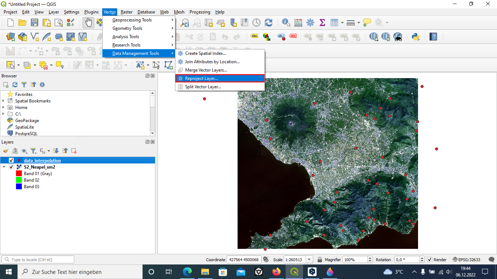
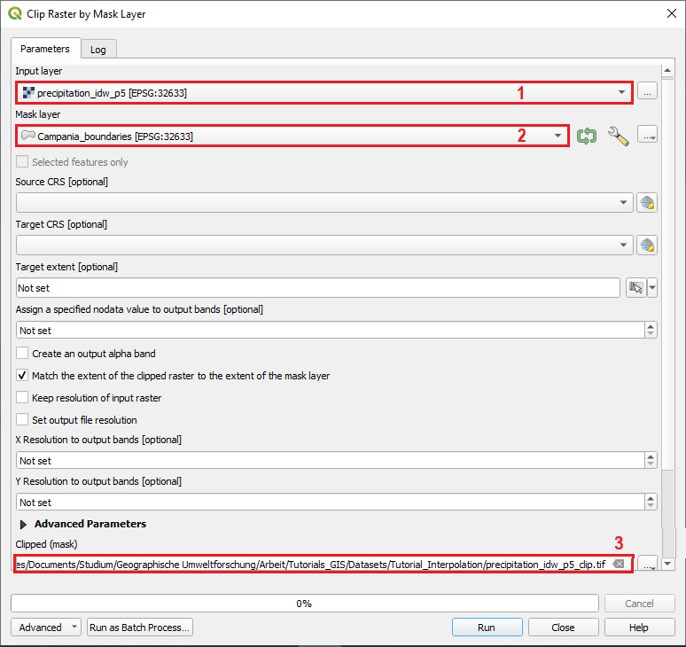
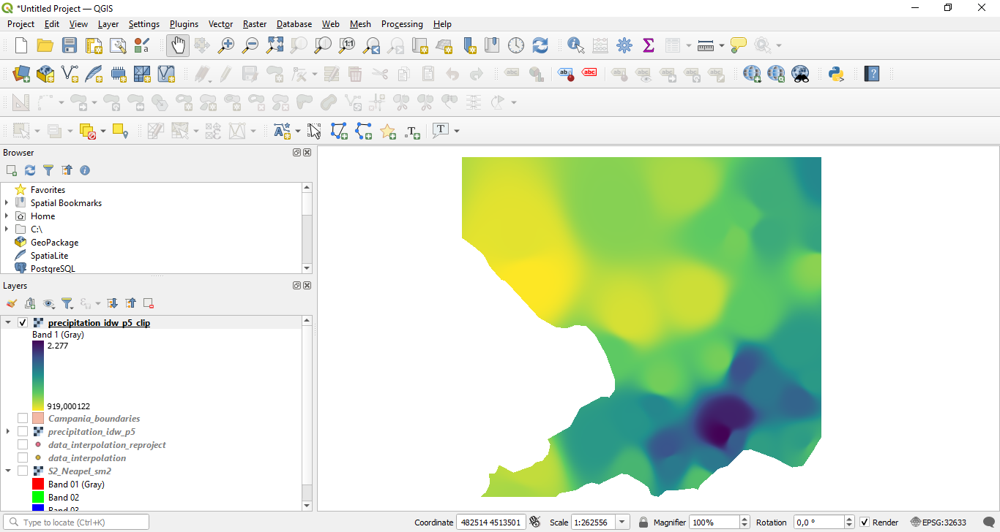

# QGIS - Tutorials

## Tutorial 9 - Spatial interpolation in QGIS

**Abstract**

After completing this tutorial you will know how to to create a continuous surface from discrete points. This process is called interpolation. 
## 1 Loading Datasets and Reprojecting 
In this tutorial we will learn how to interpolate precipitation measurements und elevation. We will make use of a precipitation dataset provided by Centro Funzionale Multirischi della Protezione Civile Regione Campania. This dataset contains the annual precipitation from the year 2021 in mm/year. We will also use global elevation data provided by United States Geological Survey (USGS) and a dataset representing the NUTS (Nomenclature of territorial units for statistics) and Statistical regions provided by Eurostat.
As a first step

**we again first load the raster dataset “S2_Neapel_sm2.tif” located in the “Datasets/S2” folder and adapt the visualization settings to have a balanced view of all classes by using the channels R=3, G=2, B=1 and loading new max / min values using the “Style”- tab in the properties window. Then we additionally load the “data_interpolation” csv located in the “Datasets/Tutorial_interpolation” folder.**

To load a text file, we select “Layer” -> “Add Layer” -> “Add Delimited Text Layer...” from the main menu in QGIS as shown in Figure 1. This will open a new dialogue as shown in Figure 2.

**Figure 1: Loading a csv file.**

First selecting the “data_interpolation” layer as input file in the field marked with “1”. Next choose the file format "CSV" marked with "2" to get numbers in integer format. Afterwards set the Geometry Definition. We are using point coordinates (marked with "3"). Select for the x field the x and for the y field the y values. Finally set the geometry crs to EPSG:4326 - WGS 84 (marked with "5") and click Add.

**Figure 2: Adding a delimited Text.**

This should lead to a situation as depicted in Figure 3.

**Figure 3: After loading the two datasets.**

We now have two datasets with different projections which we need to change in the next step to prepare the data for interpolation.
**To reproject the point data, we select “Vector” -> “Data Management Tools” -> “Reproject Layer...” from the main menu in QGIS as shown in Figure 4. This will open a new dialogue as shown in Figure 5.**

**Figure 4: Reprojecting a vector layer.**

Here we can reproject the precipitation data by

**first selecting the “data_interpolation” layer as input file in the field marked with “1”. After selecting the precipitation layer,  we set an output file in the field marked with “3” and we need to specify a target CRS in the field marked “2”. In this case, we will select the CRS with the EPSG code 32633 which is the same CRS as currently defined for the satellite image. After defining the correct Target CRS we press “OK” and QGIS will re-project the raster and add it as a new layer. If you now check the CRS of the new layer by performing a right–click, selecting “Properties” and the “General” tab, you will see that the CRS is now also set to 32633.**

**Figure 5: Reproject layer.**

## 2 IDW Interpolation
We have just successfully prepared our interpolation dataset. Next, we will interpolate the point data for precipitation and use our satellite image as a extent for that.

**Interpolation results can vary significantly based on the method and parameters you choose. QGIS interpolation supports Triangulated Irregular Network (TIN) and Inverse Distance Weighting (IDW) methods for interpolation. Now we are using the IDW method.**

First from the Processing Toolbox search and locate the "Interpolation" -> "IDW interpolation" tool as shown in Figure 6. (Remember in the main menu click "Processing" -> "Toolbox".) Double-click to launch it. 

**Figure 6: Processing Toolbox.**

In the new dialogue window we

**first select the “data_interpolation_reproject” layer as input file in the field marked with “1” in Figure 7. After selecting the interpolation layer,  we select the interpolation attribute "Precipitat" marked with "2" and click on the plus symbol to add it to the attribute window below. Next we set the "Distance coefficent P" marked with "3".** 
P is a important coefficcent in this method, because weights are proportional to the inverse of the distance (between the data point and the prediction location) raised to the power value P. So as mentioned above the result is dependent on this parameter.  As a result, as the distance increases, the weights decrease rapidly. The rate at which the weights decrease is dependent on the value of P. If P = 0, there is no decrease with distance, and because each weight is the same, the prediction will be the mean of all the data values in the search neighborhood. As P increases, the weights for distant points decrease rapidly. If the P value is very high, only the immediate surrounding points will influence the prediction.
**After setting P (you may try some different values for that) we set the extent marked with "4". For this we calculate the extent from our satellite image. Next you can set the Pixel size marked with "5". Note that the pixel size will affect the calculation time. Before you run the algorithm you can name an output file in the field marked with "6".**

**Figure 7: IDW Interpolation dialogue.**

The IDW interpolation tool will then output a black and white interpolated raster surface onto the map area as shown in Figure 8. Based on your P value and your pixel size it may look different.

**Figure 8: IDW interpolation result.**

The next step is to clip the land mass. For that 
**we are loading the "Campania_boundaries.shp" located in the “Datasets/Tutorial_interpolation” folder.** This should lead to a situation as depicted in Figure 9.

**Figure 9: After loading the campania boundaries.**

Next
**we select “Raster” -> “Extraction” -> “Clip Raster by Mask Layer...” from the main menu in QGIS as shown in Figure 10.**

**Figure 10: Opening the clipping tool.**

In the new dialogue window we

**first select the “precipitation_idw_p5” layer as input file in the field marked with “1” in Figure 11. After selecting the input layer,  we select the Mask layer "Campania_boundaries" marked with "2". As you can see in Figure 11 we are lucky that both layer have the same CRS, else we would have to reproject the layers before. Next we save the file in the field marked with "3" as a geoTIFF file.  Now click "Run"**

**Figure 11: Clip Raster by Mask Layer.**

The new clipped layer will be added to the canvas and only shows the land mass as depicted in Figure 12.

**Figure 12: Clipped Raster.**

**To make it more beautiful customize the symbology. To do it, right click the clipped raster result and select Properties (Or simply you can double click the layer name). The Layer Properties window will appear as shown in Figure 13. Select the Symbology tab marked with "1". In the Band Rendering option change the Render type to Singleband pseudocolor. (marked with "2") Then you can set your color ramp marked with "3". The color should fit to the object which is shown in a map. To classify you can set a classification mode (marked with"4") and the number of classes (marked with "5"), just explore if you want.**

After modifying the colour ramp values to reflect the range of values in a suitable way click ‘apply’ and ‘ok’ and you will now have coloured map of the IDW interpolation surface for precipitation in mm/year as shown in Figure 14.

**Figure 13: Symbology.**

**Figure 14: Result of the IDW interpolation.**
## 3 TIN Interpolation
Next, we will interpolate the elevation point data by using the Triangulated Irregular Network (TIN) method, which is mainly used for elevation.

First from the Processing Toolbox search and locate the "Interpolation" -> "TIN interpolation" tool as shown in Figure 15.

**Figure 15: Processing Toolbox.**

In the new dialogue window we

**first select the “data_interpolation_reproject” layer as input file in the field marked with “1” in Figure 16. After selecting the interpolation layer,  we select the interpolation attribute "Elevation" marked with "2" and click on the plus symbol to add it to the attribute window below. As a interpolation method we keep "linear". We set the extent marked with "3". For this we calculate the extent from our satellite image. Next you can set the Pixel size marked with "4". Last we save the output as a .tif file marked with "5" and run the algorithm.**

**Figure 16: TIN Interpolation dialogue.**

The TIN interpolation tool will then output a black and white interpolated raster surface onto the map area as shown in Figure 17.

**Figure 17: TIN interpolation result.**

In the next step we clip the land mass like we did before with the IDW interpolation.

So again,
**we select “Raster” -> “Extraction” -> “Clip Raster by Mask Layer...” from the main menu in QGIS. In the new dialogue window we first select the “elevation_tin” layer as input file. After selecting the input layer,  we select the Mask layer "Campania_boundaries". Next we save the file as a geoTIFF file.  Now click "Run"**

The new clipped layer will be added to the map area and only shows the land mass and the interpolated triangles as depicted in Figure 18.

**Figure 18: Clipped Raster.**

Now we customize the symbology like we did with the IDW interpolation. Feel free to modify the symbology as you like.

**Figure 19: Result of the TIN interpolation.**

## 4 Exercise Tutorial 9
Explain the mechanism of both interpolation methods. What are the Strengths and weaknesses?
